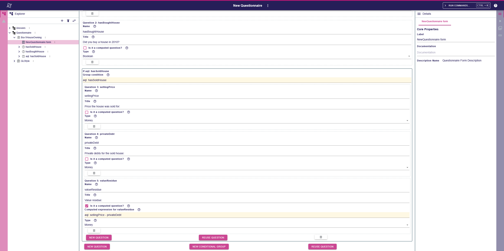
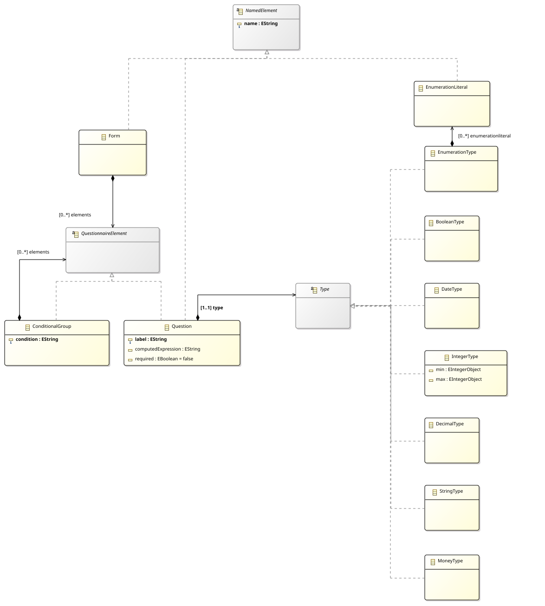
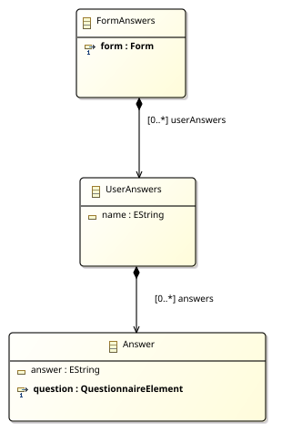
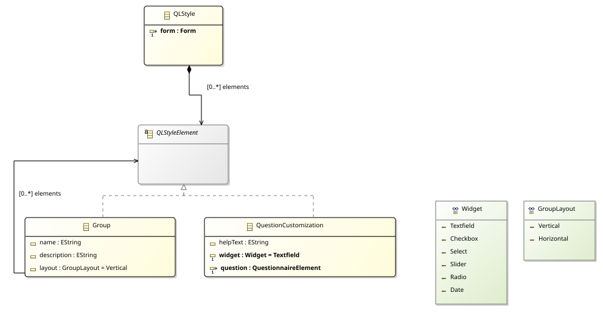
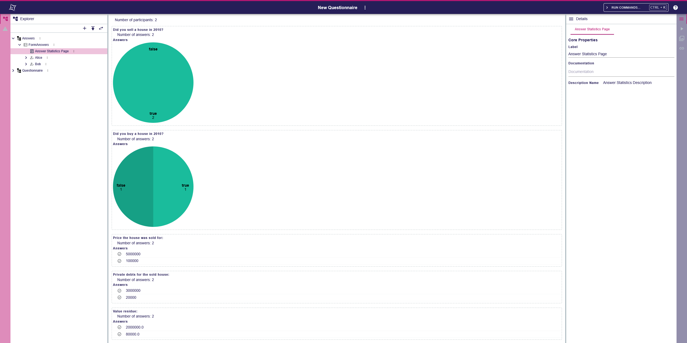

# Sirius Web - LWC25 Questionnaire

This project presents an implementation of the Questionnaire Language for the [Language Workbench Challenge 2025](https://github.com/judithmichael/lwb25), made with Sirius Web.

## Context

### What is Sirius Web

[Sirius Web](https://github.com/eclipse-sirius/sirius-web) is a language workbench, _i.e._, a tool to create languages (and DSL - Domain Specific Language) as well as their modeling environments (IDE).
Sirius Web is a cloud-native application with a default frontend working on a web browser. 
It is the successor of the Sirius Desktop project, which was a desktop application.
It specializes in the development of graphical modeling languages and proposes the development of different kinds of concrete syntax (diagram, form, table, tree, deck and gantt).
The development of a language is realized by using three different meta-languages for different concerns of a language:
- Domain DSL, to describe the abstract syntax of the language.
- View DSL, to describe the concrete syntax of the language.
- AQL (Acceleo Query Language), embedded in the View DSL, to describe the mapping between the abstract and concrete syntax.

Sirius Web does not currently provide a specific language to describe the semantics, but the language designer can fall back on Java or other technologies such as Acceleo to do this. 
The three languages can be used directly on the Sirius Web web application, to create languages in a low-code way, or programmatically by using Sirius Web as a framework.
Through the programmatic API, the language designer can directly use Ecore metamodels instead of the Domain DSL.

### Sirius Web architecture

Since Sirius Web is a web application, the architecture is mainly divided into three parts:
- The backend, with all the logic of the application. Made with Java and Spring, and uses EMF.
- The frontend, only displaying what the backend provides. Made with TypeScript and React.
- The communication protocol. Sirius Web uses GraphQL for this layer.

Finally, Sirius Web uses PostgreSQL as a database.

### Language Workbench Challenge 2025

The Language Workbench Challenge, initiated in 2013, aims to demonstrate the capabilities of modern language workbenches by modeling and implementing a relatively simple but representative DSL.
The language to implement is a questionnaire language. A questionnaire designer should be able to create a form with a list of questions. Each question has a type, determining the widget to use as well as the validation to apply to it.
The questionnaire designer can decide to add dynamic questions of two different natures: 
computed questions, where the answer is the result of an operation using answers from other questions;
conditional questions, where the answer depends on the evaluation of a predicate.
In the latter case, the condition is owned by a group to allow several questions to share the same display condition.
Finally, the subject includes several optional challenges, such as validation, a language to describe the style of the questionnaires, _etc._
The complete topic can be found [here](https://github.com/judithmichael/lwb25/blob/main/ChallengeTask.pdf).

## Our approach

We chose to realize our approach using Sirius Web as a framework instead of the low-code interface.
The reason is that we can directly version our code via Git, customize the modeling workbench a bit more, and ease the distribution.
We still use View DSL and AQL (using programmatic APIs) and replace Domain DSL with Ecore, allowing us to directly use EMF facilities.

From a user's point of view, the whole questionnaire lifecycle is done directly inside Sirius Web: the development of the questionnaire, the capability to fill it, the serialization (in database) and the display of statistics.



### Repository structure

The repository is organized as follows:
- `backend/`
  - `answer-metamodel/`: contains the EMF metamodel describing a questionnaire filled by a user. All the Java classes inside are generated by EMF Generator.
  - `answer-metamodel-edit/`: provides the needed code to use the Answer metamodel in an editor (logos, lang files, _etc_). Also mostly generated by EMF Generator.
  - `lwc25-questionnaire-starter`: the main module of the project. With the definition of the modeling workbench, the different concrete syntaxes and the code used for the questionnaire semantics.
  - `qlstyle-metamodel/`: EMF metamodel of the QLStyle language, to describe the style of a questionnaire.
  - `qlstyle-metamodel-edit/`: EMF editor facilities for the QLStyle metamodel.
  - `questionnaire-metamodel/`: EMF metamodel of the Questionnaire language.
  - `questionnaire-metamodel-edit/`: EMF editor facilities for the Questionnaire metamodel.
- `build/`
  - `sirius-web-2025.2.11.jar`: Sirius Web application, downloaded from the [official package release](https://github.com/eclipse-sirius/sirius-web/packages/2069582?version=2025.2.11).
  - `libs/`: the built jar files of the different modules from the `backend` folder.
  - `tables/`: the filled tables of the Language Workbench Challenge 2025 for Sirius Web.

### Quick start

You will simply need:
- [Java 17](https://adoptium.net/temurin/releases/) or later
- [Docker](https://www.docker.com/), or an existing PostgreSQL 12 (or later) installation with a DB user that has admin rights on the database (those are needed by the application to create its schema on first startup).

Then, download or clone the `build` folder then, inside the folder:
```sh
# Execute the database through docker
docker run -p 5438:5432 --rm --name sirius-web-postgres -e POSTGRES_USER=dbuser -e POSTGRES_PASSWORD=dbpwd -e POSTGRES_DB=sirius-web-db -d postgres:15
# Execute the application with the different libraries
java -Dloader.path=file:libs/ -Dloader.main=org.eclipse.sirius.web.SiriusWeb -cp sirius-web-2025.2.11.jar org.springframework.boot.loader.launch.PropertiesLauncher --spring.datasource.url=jdbc:postgresql://localhost:5438/sirius-web-db --spring.datasource.username=dbuser --spring.datasource.password=dbpwd
```
> [!NOTE]
> If you are using Windows PowerShell, you will need to quote the two first parameters of the java command.
> For instance: `-Dloader.path=file:libs/` → `"-Dloader.path=file:libs/"`

Finally, go to http://localhost:8080 to access the application.
From here, you can click on "Show all templates" then on "Questionnaire" to start a questionnaire project.

### Example

We reproduce the box house owning as an example in this video:

https://youtu.be/IDtrN2CC1hc

### Implementation Overview

#### Metamodels

Our implementation relies on three metamodels: 
one for the questionnaire language, one for the questionnaire style language, and one to represent the answers of the users to the questionnaire.

Figure 1 illustrates the metamodel for the questionnaire language. A "Form" (representing a questionnaire) can have multiple QuestionnaireElements, 
which are a Question, a ConditionalGroup or a QuestionReuse.
All have a name, and the first two may have an expression (required for the ConditionalGroup), representing either the condition to evaluate or the dynamic value of the question.
In the metamodel, the expressions are modeled using a String type. 
A QuestionReuse is linked to an existing question and allows reusing a question without having to redefine it.
In practice, we made the choice to reuse AQL (an OCL-like language) as the expression language.
Finally, a Question has a label (displayed to the questionnaire user), may be optional and has a type.
The supported types are Enumeration, Boolean, Date, Integer, Decimal, String and Money.
An Integer type may have bounds and Enumeration type has several literals.

Even if the "optional" field is present, we did not have time to effectively implement it.


_Figure 1: Questionnaire metamodel_

Figure 2 illustrates the metamodel of the user answers.
This metamodel is really simple since its main goal is to store the answers of a questionnaire and to integrate them into the lifecycle of Sirius Web.
A FormAnswer has several UserAnswers, which are associated with a person name.
A UserAnswer contains all the answers of the associated person.
An Answer contains its value (`answer` field) and is linked to the answered Question.


_Figure 2: Answers metamodel_

Figure 3 illustrates the metamodel of the Questionnaire Style language.
A QLStyle is linked to an existing form and has multiple QLStyleElements.
A QLStyleElement is a Group (not implemented) or a QuestionCustomization.
A QuestionCustomization is linked to an existing question and can set a help text for this question.
If possible, the questionnaire designer can also change the widget of a question among Textfield, Checkbox, Select, Slider, Radio or Date.
The possible widgets depend on the type of the question.
A Date question can only be represented by a date widget, but a bounded integer question can be represented by a textfield, a select, a slider or a radio group.


_Figure 3: Questionnaire Style metamodel_

#### Concrete syntax

Sirius Web provides a default concrete syntax for each metamodel, which is a reflective tree representation (available in the explorer view, on the left of the studio).
We also programmed four different concrete syntaxes:

- To design the questionnaire (linked to a Form element)
- To design the style of a questionnaire (linked to a QLStyle element)
- To answer a questionnaire (linked to a UserAnswers element)
- To see statistics on the questionnaire's answers (linked to a FormAnswers element)

Each has for notation a form, since we thought it was the most adapted notation for a questionnaire.
To develop them, we use the Java API of the View DSL, taking the form of builder patterns (see `/backend/view`).
AQL is used as a String to map the different concepts of the metamodel to the concrete syntax.

Here is a small example. We want to create a textfield representing the name of a Question for the Questionnaire metamodel.
The `valueExpression` is an AQL query to define the content of the textfield. Here we are starting from the current question (`question` variable) and getting its name.
Then, to update the model element when modifying the textfield, we use Sirius Web operations in the `body` field.
Here we are switching the context to select the question, then we are using the `setValue` operation to set its name (`featureName` field)
to the new value of the textfield (`newValue` variable).

```java
var questionNameDescription = formBuilderHelper.newTextfieldDescription()
        .name("Question Name Description")
        .labelExpression("Name")
        .valueExpression("aql: question.name")
        .body(viewBuilderHelper.newChangeContext()
                .expression("aql: question")
                .children(viewBuilderHelper.newSetValue()
                        .valueExpression("aql: newValue")
                        .featureName("name")
                        .build())
                .build())
        .helpExpression("The name of the question. Not displayed to the questionnaire user but can be used in the different expressions as a variable containing the user's answer for this question.")
        .diagnosticsExpression("aql: question.validateQuestionName()")
        .build();
```

The four concrete syntaxes are defined in a similar way.

The concrete syntax of the Questionnaire language also provides:
- buttons to create question/question reuse/conditional group 
- buttons to delete them
- Help text to understand the meaning of each field.

Finally, the concrete syntax of the Questionnaire Style language provides:
- Button to refresh the styles from the linked questionnaire, adding new styles for questions that have been created recently
- Buttons to move the question, to define a display order different from the definition order
- A preview of the different questions, to see how they will look when changing the widget.

The concrete syntax definition of user answers is entirely decoupled from the application of styles.
The styles rendering is injected by Spring, enabling the deletion of code related to the styles without having to change the code of the rendering of the answers.

#### Static Semantics

Most of the static semantics is enforced by the concrete syntax itself.
Indeed, if we take the example of the widget choice in QLStyle, the widget `Date` will never be proposed for an integer question.
In the same way, the widget `radio` will not be proposed for a non-bounded integer question.

However, we still implement some static semantics rules:

- In Questionnaire, an Integer type cannot have a min value greater than the max value.
- In Questionnaire, the AQL expressions trigger an error when Sirius Web detects non-existing variables.
- In Questionnaire, a condition expression must be a boolean expression or a unique variable; in that case, the `undefined` or `null` value is considered as `false`.
- In Questionnaire, two questions cannot be (transitively) dependent on each other; for that, we apply a depth-first search on the dependency graph to detect cycles.
- In Questionnaire, two questions cannot have the same name.
- In Answers, an integer answer must be within the bounds of its type if it defines bounds.
- In Answers, an integer answer in a textfield must be a valid integer.
- In Answers, a decimal or money answer in a textfield must be a valid decimal.

These static semantics rules are directly implemented in Java and EMF.
Through AQL expression, we can call Java functions existing in the backend, so we trigger the validation in this way.
For instance, the code earlier snippet has a field `diagnosticsExpression` that contains an AQL expression.
Inside, we can directly use AQL to define a validation and return a String when an error is detected, or call a Java function as done in this example.
`validateQuestionName` is then a Java function that returns an EMF diagnostic object, directly displayed by Sirius Web around the widget.
Finally, the validation rules are also used by EMF Validation to validate them over other concrete syntaxes (for instance, the reflective-tree representation).

#### Dynamic Semantics

Sirius Web works in a live way. 
When changing the style of a question, all answers referring to this question will automatically be updated to display the new style.
In the same way, if the questionnaire designer changes the type of a question, this will automatically update the proposed widgets in its style model.
All the rendering part is automatically managed by Sirius Web, according to the description we gave of the concrete syntax.
In fact, the View DSL models are also used as transformation rules.

Therefore, the main dynamic semantics we had to manage manually was the evaluation of the AQL expressions.
For that, we simply take the String expression and give it to the AQL Interpreter, with the available variables and their values.
If an answer is empty (empty string), we set its variable to null.
An expression can refer to all other questions (except its own question).
A question reuse refers to the same answer as the question it reuses.
If at least one variable has a null value, we return false in the context of a condition, or empty string in the context of a computed question.
Finally, we added a new built-in variable `undefined` having the value `null`.
This allows the questionnaire designer to use `undefined` instead of `null`, as is the case in the statement.
In the context of a computed question, the result is stored as an answer, allowing chaining computed questions.
Finally, when a question is hidden, the value of its answer is reset, unless a reuse question is displayed. 

To finish, the answers of all users can be displayed in a statistics page.
This page presents the number of participants and answers for each question, as well as the values themselves.
By default, the values are displayed as a list, but when the question type is a boolean or an enumeration, the used widget is a pie chart.
This page is automatically refreshed when there are new answers or answer modifications.



#### Others

Sirius Web allows live optimistic collaboration; therefore, the questionnaire language, styles and answers can be used by several users at the same time.

We added a template to easily create new questionnaires directly from the home page of Sirius Web.

## Metrics

- **Development period**: ~2 weeks
- **Number of abstract syntaxes**: 3
- **Number of concrete syntaxes**: 4
- **Number of metaclasses**: 24 (15 for Questionnaire, 3 for Answers, and 6 for Style)
- **Total Source Lines of Code**: 4019

Detail per language:

| Language             | Files | Lines | Blanks | Comments | Code |
|----------------------|-------|-------|--------|----------|------|
| Java                 | 49    | 3668  | 579    | 244      | 2845 |
| SVG (concepts icons) | 22    | 322   | 0      | 0        | 322  |
| XML (pom.xml)        | 8     | 954   | 39     | 63       | 852  |
| **Total**            | 79    | 4944  | 618    | 307      | 4019 |

> [!NOTE]
> We use the tool [`scc`](https://github.com/boyter/scc?tab=readme-ov-file#addingmodifying-languages) to count the SLOC.
> To reproduce, simply run `scc` at the root of the repository.
> We exclude all generated files from the count, including EMF generated files.
> To see in detail the filters we applied, check the different `.sccignore` files in the repository.


